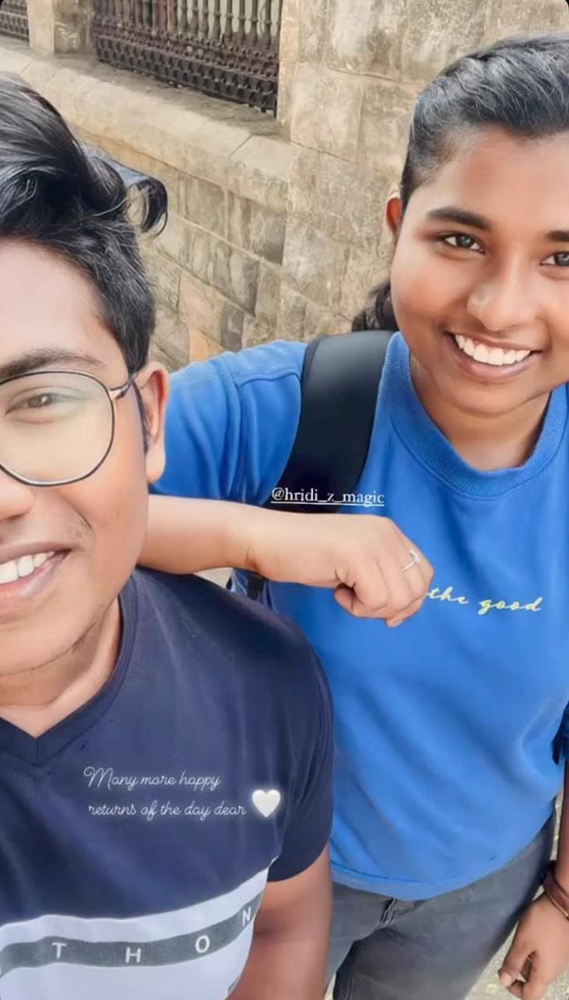
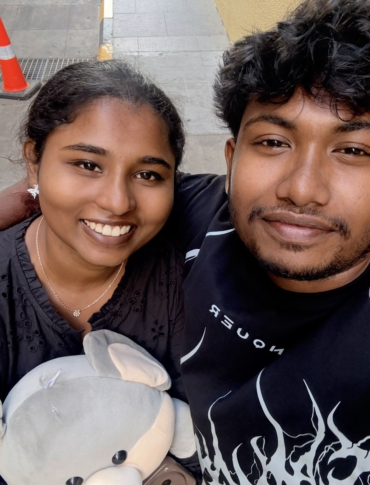
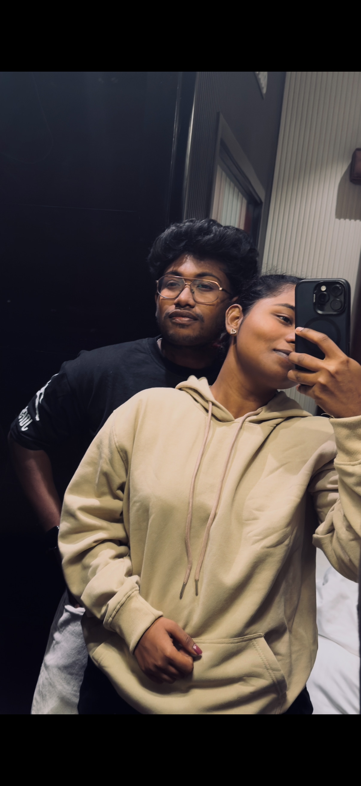
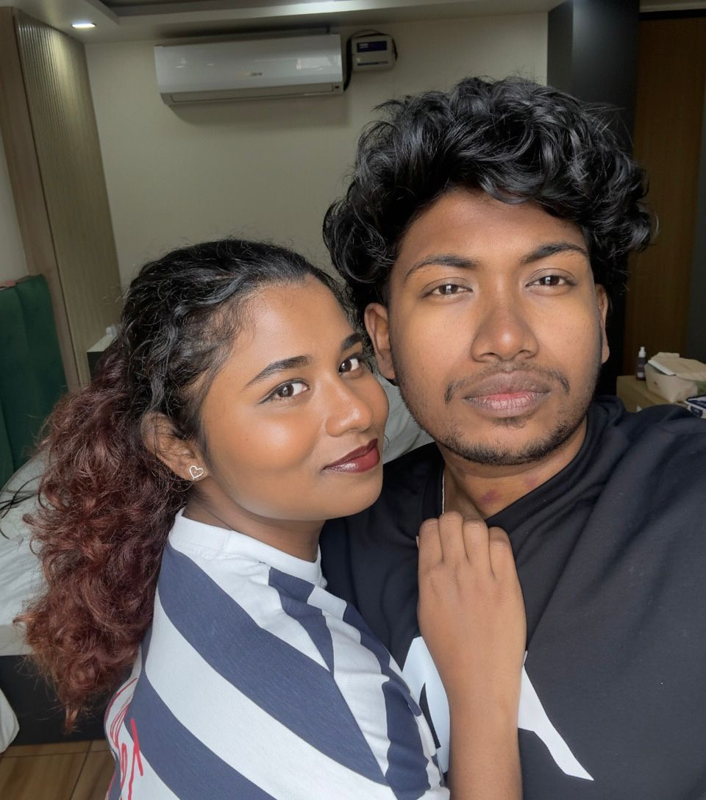

<!DOCTYPE html>
<html lang="en">
<head>
    <meta charset="UTF-8">
    <meta name="viewport" content="width=device-width, initial-scale=1.0">
    <title>For You, Always ❤️</title>
    <link href="https://fonts.googleapis.com/css2?family=Playfair+Display:wght@400;600&family=Great+Vibes&display=swap" rel="stylesheet">
    <link rel="stylesheet" href="style.css">
</head>
<body>

    

        <h1>This isn’t the end…   it’s the beginning ❤️</h1>
    

    

        
Now open your eyes…

        
    

    <audio id="bgMusic" loop>
        <source src="assets/epidivanthayo.mp3" type="audio/mpeg">
    </audio>

    <button class="music-btn" onclick="toggleMusic()">🎶 Play Music</button>
    <button class="night-btn" onclick="toggleNight()">🌙 Night Mode</button>

    <section class="fade">
        <h1>Dear Hridumma</h1>
        
Idhe verum ore website alla   enik enghne ente feelings express chyanonn ariyilla   ee website ninak vendiyane ninakk mathram   I MISS YOU 

    </section>

    <section class="fade">
        <h2>Our Story</h2>
        
Hridumma ninne njan adhyam kanunne ore whatsapp status koodeyane anne  
    ninne enikk ishtayi nammal samsarich koree njn ninne nallapole manasilakki 
    enee adhyayit ore aal care chynn enet karyangal okke anweshikunn adhokke 
    ente lifil firttime appo njan thirumanichu you are the one for me ennu. 
    nammal koore life spend chythu happy aayirunn appo ore 1half years break 
    The worst dicition i ever take in my life taking a break ente thettane  
    ente mathram ninne njan kore vishamipichu koree njn karanam ninte life onnum 
    aakandann karuthi ninne njan avoid chyunna pole chythitumm enne konne pattanghjitum 
    anghne okke chyendivannu but you are the one for me and forever verarkum  
    ninak vendi mathram ahne njan mariyathe i change my life for u as you wish  
    i am really happy to be with you really love you hridumma.   ..

    </section>

    <section class="fade">
        <h2>A Moment Frozen in Time</h2>
        <video controls>
            <source src="assets/us234.mp4" type="video/mp4">
        </video>
    </section>

    <section class="fade">
        <h2>US</h2>
        

            
            
            
        

    </section>

    <section class="fade">
        <h2>Why I Love You</h2>
        

            
Ne ente ellam ahne

            
The girl who need me to get sleep

            
I cant be without you..

            
The girl doesn't judge me

            
She made me a better person.

            
Ente ella downfallilum koode ninnathine

        

    </section>

    <section class="fade">
        <h2>Just One More Thing</h2>
        <button onclick="openEyesReveal()">Close your eyes for a moment ❤️</button>
    </section>

    <section class="fade">
        <h2>One Last Question</h2>
        
Will you be my Valentine? 💖

        

            <button onclick="yesEnding()">Yes 💕</button>
            <button id="noBtn" style="position:absolute;left:60%;">No 🙃</button>
        

    </section>

    
</body>
</html>
